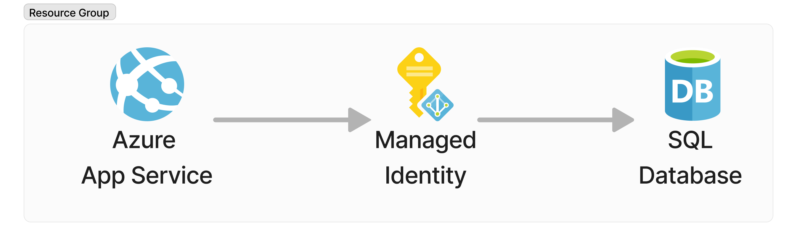

# Accessing Azure SQL Server with a User-Assigned Managed Identity
It is easier to design and mantain a secure system than to add security after the fact.  When it comes to the Microsoft Cloud there are plenty of tools and guides on building a secure architecture, some are listed in the [references](#references) section of this post. Now automating those best practices into your SDLC is the real challenge.

In this post we will enforce one of those best practices "**Minimize the use of password-based authentication for users**".  We will do so in a simple web application hosted in an Azure App Service that relies on an Azure SQL Database and we will be using an User-Assigned Managed Identity to avoid the need of passwords. 

## Architecture

This is about as simple as an cloud architecture can get. We are deploying within the context of an Resource Group an App Service that will be running a simple web application that uses a User-Assigned Managed Identity to authenticate to an Azure SQL Database.  

## Deploying your Resources
All resources will be defined in a bicep file that is going to be used to deploy a full working solution out to Azure. The following are a set of parameters that are going to be used across all resources.  Specifically we are creating a set tags based on a `suffix` provided to the script and using the location of the resource group that the resources are going to be created in as the default location for all resources.  We are also adding a [Mockaroo](https://mockaroo.com) API Key value that is used by the demo code associated to this post to generate sample data.

```bicep
// parameters.
@description('The suffix to be used for naming of resources in this deployment.')
param suffix string
@description('The Mockaroo API key used to generate test data.')
param mockarooApiKey string 
@description('The location where all resources are to be deployed.')
param location string = resourceGroup().location

// tags for all resources.
var tags = { env: suffix }
```

> The bicep file showcased in this blog can be used to fully automate the deployment of resources out to Azure using just the raw template.  The template can be hosted in an **[Deploy To Azure]** button for example or copy-pasted as a new template into the Azure templating tools.  That being said, there are some drawbacks when it comes to security in the showcased template as the Managed Identity will have to be granted `dbowner` privileges on the Azure SQL Database for this to work without any user intervention after deployment. It is best practice to limit the Managed Identity privileges to simply read, write and execute (DML).  On a future blog, we will be revisit this scenario and focus on how to make the necessary changes to support a more complex security model through a Continuous Delivery pipeline and using a Managed Identity with limited permissions.

### User-Assigned Managed Identity
The User-Assigned managed identity that is going to be the glue for all resources.

```bicep
// User-Assigned Managed Identity
resource identity 'Microsoft.ManagedIdentity/userAssignedIdentities@2023-01-31' = {
  name: 'user-${suffix}'
  location: location
  tags: tags
}
```
### Azure SQL Database and Server
In order to define our Azure SQL Database we got to define the Azure SQL Server it is going to be associated to. For this demo, we are using the User-Assigned Managed Identity as the Azure AD Administrator for the server by making use of the `azureADAuthentication`, `administratorType`, `principalType`, `sid` and `tenantId` administrator properties.

```bicep
// Azure SQL Server
resource dbServer 'Microsoft.Sql/servers@2022-05-01-preview' ={
  name: 'sqlsrv-${suffix}'
  location: location
  tags: tags
  properties: {
    administrators: {
      azureADOnlyAuthentication: true
      login: identity.name
      administratorType: 'ActiveDirectory'
      principalType: 'Application'
      sid: identity.properties.clientId
      tenantId: tenant().tenantId
    }
  }
}
```
By default the Azure SQL Server will restrict all incoming traffic, we want to allow Azure Services to access the database by enabling the *Allow Azure Services and Resources to access this server*.  This can be done by enabling the following firewall rule exception.

```bicep
// Allow Azure Service and Resources to access this server
resource allowAllWindowsAzureIps 'Microsoft.Sql/servers/firewallRules@2022-05-01-preview' = {
  name: 'AllowAllWindowsAzureIps' // don't change the name
  parent: dbServer
  properties: {
    endIpAddress: '0.0.0.0'
    startIpAddress: '0.0.0.0'
  }
}
```

We can then define the Azure SQL Database by providing the minimum information required. 

``` bicep
// Azure SQL Database.
resource database 'Microsoft.Sql/servers/databases@2022-05-01-preview' = {
  parent: dbServer
  name: 'sqldb-${suffix}'
  location: location
  properties: {
    collation: 'SQL_Latin1_General_CP1_CI_AS'
    catalogCollation: 'SQL_Latin1_General_CP1_CI_AS'
    maxSizeBytes: 10737418240
    licenseType: 'LicenseIncluded'
  }
}
```

### Azure App Service and Plan
Finally we can build our Azure App Service and Plan using the following bicep resource definitions.  The key configurations for the Azure App Service are the use of the `identity` element to assign a User-Assigned Managed Identity by referencing the `identity` we already defined, and additionaly configuring the connection string to be aware of the `Client ID` of the User-Assigned Managed Identity. 

```bicep
// Azure App Service Plan
resource serverfarm 'Microsoft.Web/serverfarms@2022-03-01' = {
  name: 'plan-${suffix}'
  location: location
  tags: tags
  sku: {
    name: 'P2v2'
  }
  kind: 'linux'
  properties: {
    reserved: true
  }
}

// Azure App Insights
resource insights 'Microsoft.Insights/components@2020-02-02' = {
  name: 'ai-${suffix}'
  location: location
  tags: tags
  kind: 'web'
  properties: {
    Application_Type: 'web'
    RetentionInDays: 90
    publicNetworkAccessForIngestion: 'Enabled'
    publicNetworkAccessForQuery: 'Enabled'
  }
}

// Azure App Service
var linuxFxVersion = 'dotnetcore|7.0'
resource site 'Microsoft.Web/sites@2022-03-01' = {
  name: 'app-${suffix}'
  location: location
  tags: tags
  identity: {
    type: 'UserAssigned'
    userAssignedIdentities: {
      '${identity.id}': {}
    }
  }
  properties: {
    serverFarmId: serverfarm.id
    siteConfig: {
      linuxFxVersion: linuxFxVersion
      logsDirectorySizeLimit: 100
      detailedErrorLoggingEnabled: true
      appSettings: [
        { name: 'APPINSIGHTS_INSTRUMENTATIONKEY', value: insights.properties.InstrumentationKey }
        { name: 'Mockaroo__ApiKey', value: mockarooApiKey },
      ]
      connectionStrings: [
        { 
          name: 'DefaultConnection'
          type: 'SQLAzure'
          connectionString: 'Server=tcp:${dbServer.name}${environment().suffixes.sqlServerHostname},1433;Database=${database.name};Authentication=Active Directory Managed Identity;Encrypt=True;User Id=${identity.properties.clientId};'
        }
      ]
    }
  }
}
```

### Deployment (Source Code)
Normally this task would be handled on your continuous delivery server, but for purposes of this demo code being fully functional we are going to add a manual source control deployment configuration that will pull the code from GitHub on the Azure App Service startup from a specified branch by adding to the bicep definition file.

```bicep
// Source control deployment.
resource sourceControl 'Microsoft.Web/sites/sourcecontrols@2022-03-01' = {
  name: 'web'
  parent: site
  properties: {
    repoUrl: 'https://github.com/overridethis/az-app-sql-managed-identity.git'
    branch: 'main'
    isManualIntegration: true
  }
}
```

Finally, you can deploy the application to Azure by following these steps:
1. Register for a [Mockaroo API](https://www.mockaroo.com) license key.
   > Mockaroo API will be used to generate data for the demo application for the source control deployment is pointing to once it is deployed and running.
2. Install the [Azure Command-Line Interface (CLI)](https://learn.microsoft.com/en-us/cli/azure/). 
3. Ensure you are authenticated to the Azure Command-Line Interface. 
4. From the folder containing your `main.bicep` file execute the following `az` cli command.
   ```sh
   az group create --name {NAME_OF_RESOURCE_GROUP}
   az deployment group create --template-file main.bicep \
       --resource-group {NAME_OF_RESOURCE_GROUP}
       --location eastus2 \
       --parameters suffix={YOUR_CUSTOM_SUFFIX} mockarooApiKey={YOUR_MOCKAROO_API_KEY}
   ```   

## Reference
1. All source code showcased in this article.[https://github.com/overridethis/az-app-sql-mid](https://github.com/overridethis/az-app-sql-mid)
1. [Playbook for addressing common security requirements with Azure SQL Database and Azure SQL Managed Instance](https://learn.microsoft.com/en-us/azure/azure-sql/database/security-best-practice?view=azuresql)
1. [An overview of Azure SQL Database and SQL Managed Instance security capabilities](https://learn.microsoft.com/en-us/azure/azure-sql/database/security-overview?view=azuresql)
1. [Microsoft Operational Security Practices - Practice #4 - Protect Secrets](https://www.microsoft.com/en-us/securityengineering/osa/practices#practice4)